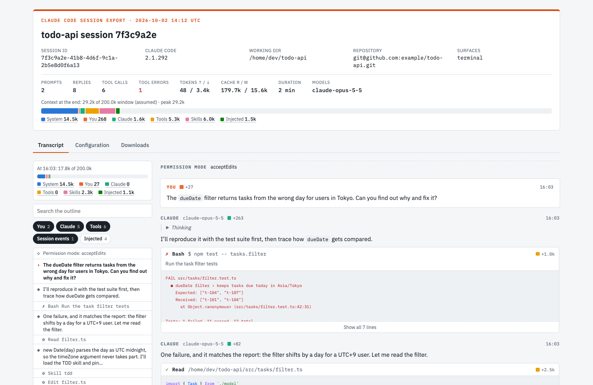

# session-export

A Claude Code session goes wrong: a tool call failed without a word, Claude ignored an instruction, or the context filled up faster than you expected. To find out why, you need what Claude saw. The built-in `/export` gives you the terminal, the messages you watched scroll by. It leaves out the tool results, the reminders Claude Code injects, the subagent runs and the settings the session ran under.

This plugin keeps the whole record and makes it readable. One command turns the session into a private claude.ai page that puts the raw transcript next to a viewer and the configuration the session used. You can work out what happened yourself, or send the link to the teammate who has to.



<sub>A sample session, made up for this screenshot.</sub>

## What you get

Run `/export-session` and it replies with a link. The page has:

- **A transcript viewer.** Every prompt, reply, tool call and result, with an outline you can search and filter.
- **A context bar.** How full the context window got, and how much of it came from you, Claude, tools, skills or injected text.
- **The configuration.** The settings, tools, slash commands and instruction files the session ran with, credentials redacted.
- **The raw files.** The JSONL transcript and `config.json`, ready to download.

## Install

At the prompt of a Claude Code session:

```
/plugin install session-export --marketplace cateland/claude-session-export
```

Answer `y` to add the marketplace, then pick a scope. The command works at once, with no restart. Run `/export-session` again in the same session to update the same page.

## The page in detail

**Header**, shown on every tab: session id, Claude Code version, working directory, repository, prompt, reply and tool counts, tokens, duration, models, and the context bar.

**Context bar**: the context window split into System, You, Claude, Tools, Skills and Injected. Hover a legend term for its definition. The total for each request comes from the API usage in the transcript. The split between origins is an estimate: the plugin shares out what each request added by text length. The window size is a guess too: 200k, or 1M once a request went past 200k.

**Transcript tab**, modeled on [pi](https://github.com/badlogic/pi-mono)'s HTML export:
- An outline with search and filters you can combine: You, Claude, Tools, Session events, Injected.
- A second context bar that follows your scroll, and a `+N` badge on each entry for the context it added.
- Markdown replies, collapsible thinking, and a view for each tool: Bash output, Read with highlighting, Edit diffs, Write content.
- Keys: `T` toggles thinking, `O` expands every output, `Esc` clears the search.

**Configuration tab**: merged settings and each source (user, project, local, flag, policy), the tools Claude could call, slash commands, and the instruction files loaded from the project tree.

**Downloads tab**: `config.json` and each transcript. Transcripts save as `.jsonl.txt` because artifacts can't serve `.jsonl`; drop the `.txt` to get the original file.

## Privacy

The page starts private, and you decide who sees it.

The plugin redacts settings values that look like credentials: `env` values, and keys containing token, secret, auth, password, cookie or helper. It leaves the transcript as it is. The transcript holds everything tools read during the session, secrets included, so read it before you share the link.

## Requirements and limits

- Claude Code with mods (function hooks). The plugin targets 2.1.292, and the mods API is early access, so a later release may break it.
- macOS or Linux: the export calls `find`, `cp`, `mkdir` and `rm`.
- The plugin skips transcript files over 16 MB, or past 60 MB in total, and lists them as local only.
- Claude Code asks you to approve the first publish. Each export overwrites the files the plugin published before: `config.json` and the transcript copies.

## Development

```
claude plugin validate .
claude plugin test .
```

Run a local copy with `claude --plugin-dir .`

`hooks/` runs inside Claude Code. The plugin reads `assets/viewer.js` and `assets/viewer.css` and inlines them into the page, so they run in the browser. The transcript parser in `viewer.js` exports pure functions, and `hooks/viewer.test.ts` covers them.

## Feedback

Did the viewer misread a transcript, or leave out a field you need when you debug? [Open an issue](https://github.com/cateland/claude-session-export/issues) and name the record type that tripped it. I can help you trace an odd session too.

## License

MIT
